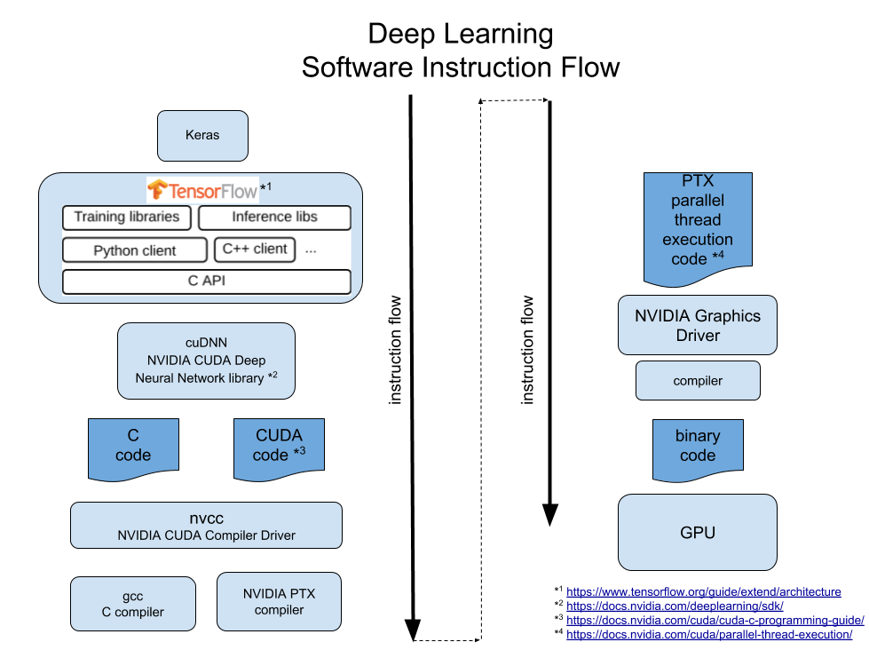

# Description
Script for printing system- and version information about installed hardware and software used in deep learning.
Aimed at Keras with Tensorflow on Linux with NVIDIA hardware.

# Background 
I have come about the set of commands in this script when trying to compile Tensorflow from source to work 
with my newly purchased Nvidia Geforce RTX 2070. I switched between software versions multiple times to get it to work.
I used the commands in this script to check which software versions are actually installed and to find any discrepancies between them.

# Tensorflow 1.12 build
In the end I succeeded in a build of Tensorflow 1.12 from source using the following:
- OS: Ubuntu 18.04
- linux kernel: 4.15.0-45-generic
- architecture: amd64 (so 64-bit)
- python: 3.6.2
- tensorflow: 1.12.0
- cudnn: 7.5
- nvcc: 10.0
- CUDA: 10.0.130
- gcc: 4.8.5
- g++: 4.8.5
- bazel: 0.15.0

Is used this build to work with:
- keras: 2.2.4
- keras-applications: 1.0.6
- keras-preprocessing: 1.0.5

A download link for the resulting wheel will follow here shortly.

# Tensorflow 1.13 build
I am currently working on this
     
# Requirements
- OS: Linux
- Hardware: NVIDIA

# Restrictions
Software: Keras with Tensorflow (Theano, Pytorch, Caffe, and others are not supported)
  
# Disclaimer
These scripts are highly experimental and they come without warranty of any kind.
I take no liability for the accuracy, correctness, completeness, or usefulness of these scripts nor for any sort of damages using these scripts may cause.

**Use these script at your own risk only!**

# Software Instruction Flow
The following image helped me getting a better intuition of the flow of software instructions:

